# SG BusFlow

Singapore bus arrivals, nearby stops, and journeys. Live times come from [LTA DataMall](https://datamall.lta.gov.sg/). The phone and the website never call LTA themselves.

There is no account. Saved stops stay on the device. If GPS is off, the app says so and falls back to a Boon Lay pin so the screens are not empty.

The app runs on this machine with Docker. It is not hosted.

## Screenshots

Light theme. Shot on Expo Go.

| Nearby | Search |
| --- | --- |
|  | 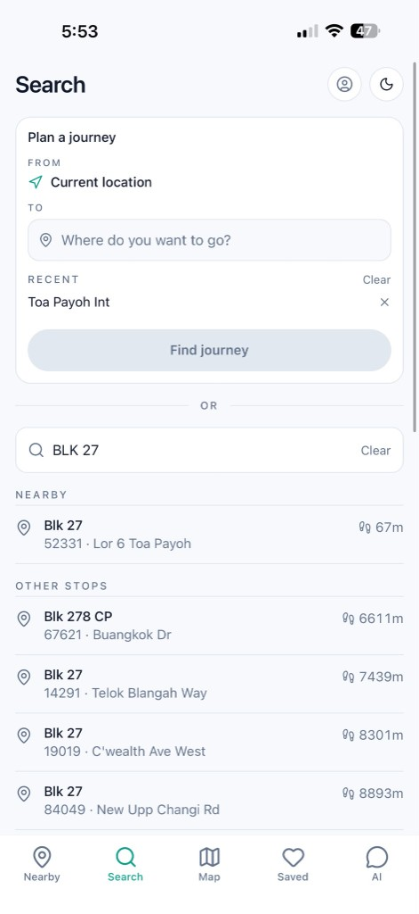 |

| Stop | Journey |
| --- | --- |
| 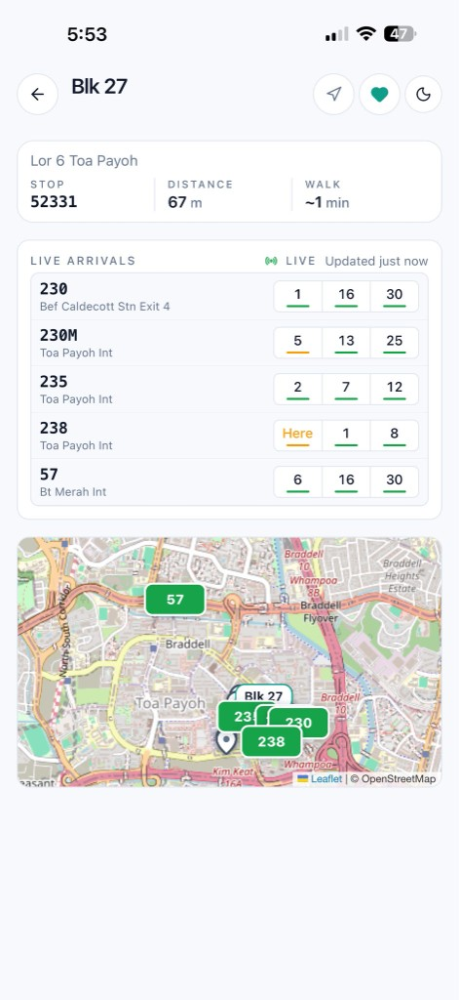 | 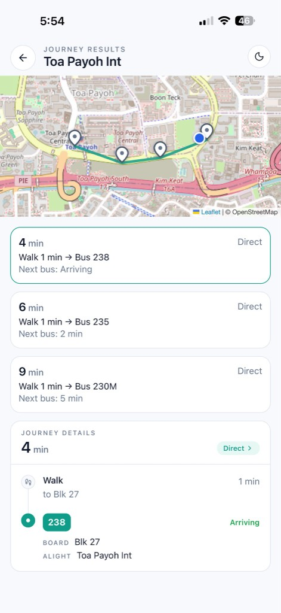 |

| Map | Live bus |
| --- | --- |
| 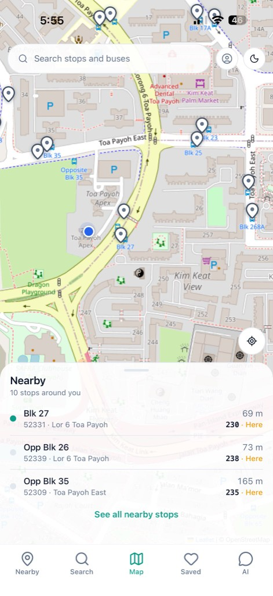 | 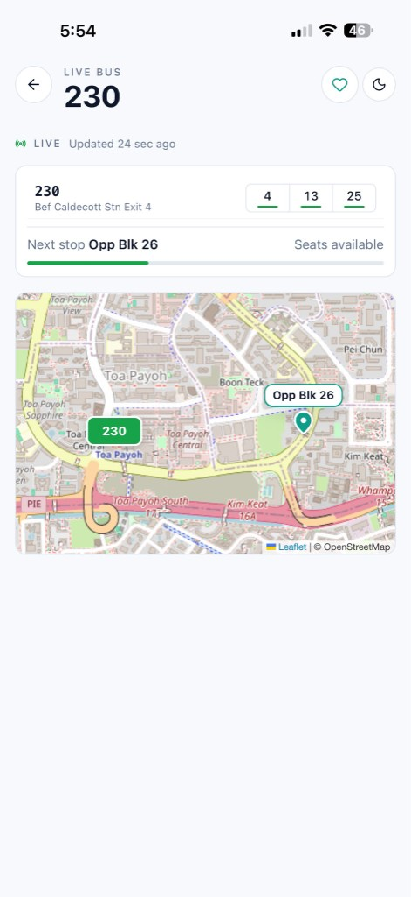 |

| Saved | Assistant |
| --- | --- |
| 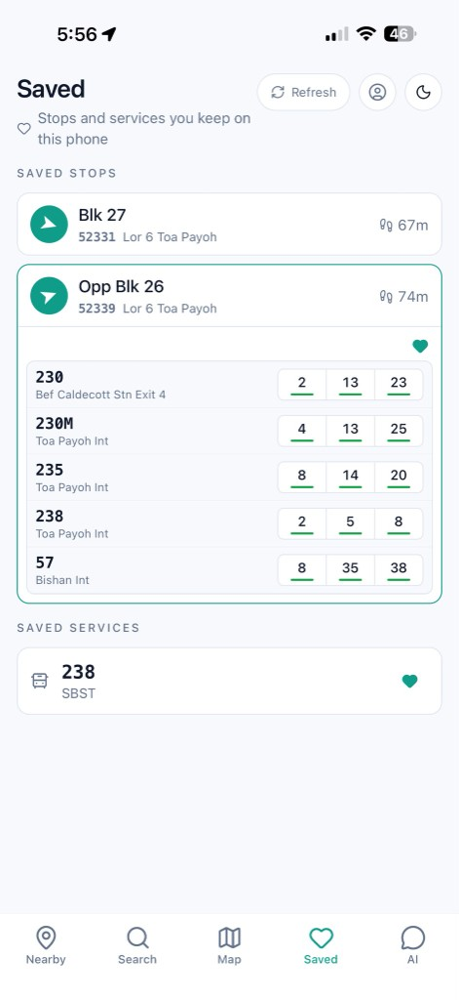 | 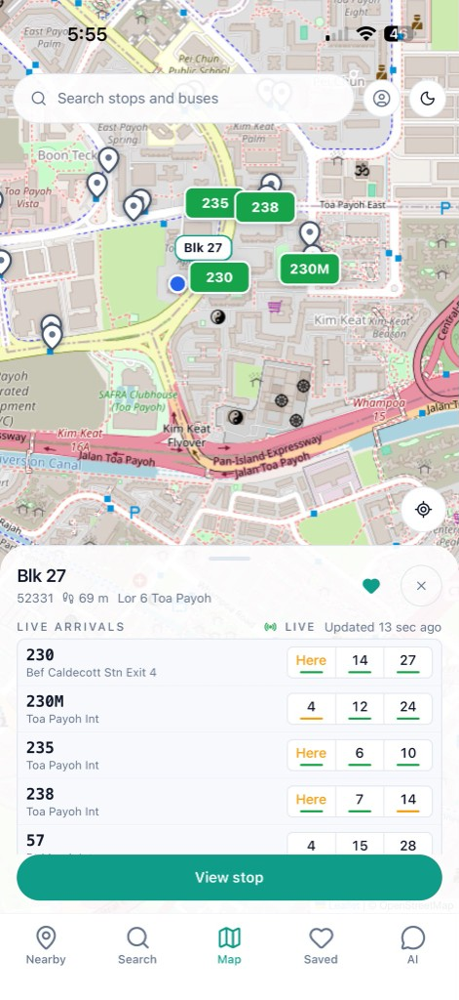 |

Dark theme uses the same screens.

| Nearby | Map |
| --- | --- |
| 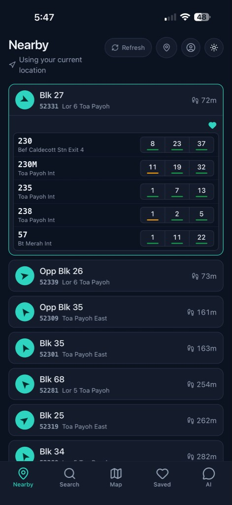 | 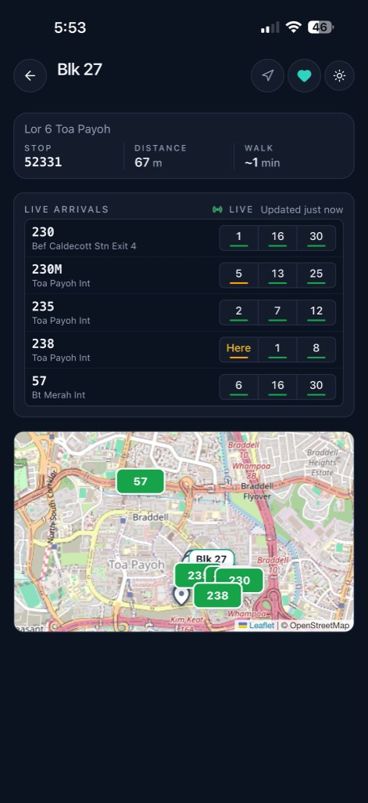 |

| Journey | Saved |
| --- | --- |
| 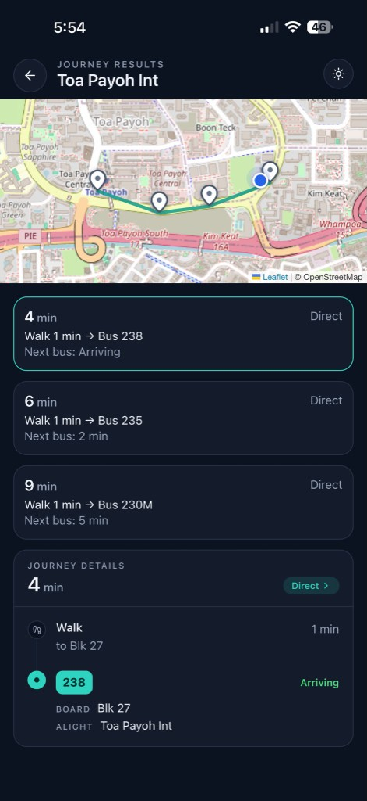 | 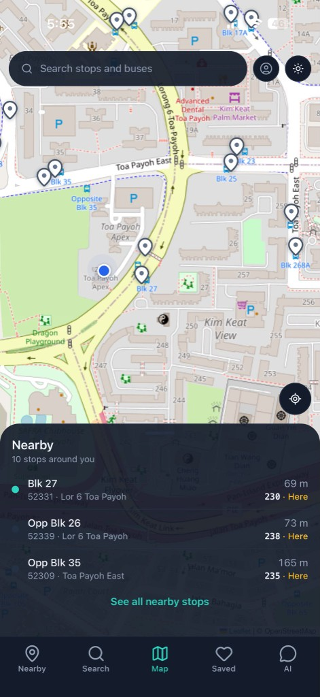 |

## Stack

| Piece | Choice |
| --- | --- |
| Web | Next.js 15, React, Tailwind, Leaflet |
| Mobile | Expo (Expo Go), React Native |
| API | FastAPI, Pydantic, SQLAlchemy |
| Database | PostgreSQL + PostGIS |
| Cache and live fan-out | Redis, WebSockets |
| Arrivals | LTA DataMall, one worker |
| Assistant | Groq, then Gemini, then OpenAI. It only explains results the API already returned. |
| Checks | Docker Compose, pytest, GitHub Actions |

## How it fits together

```
LTA DataMall
      │
      ▼
   Worker  ──────────────►  PostgreSQL + PostGIS
      │                     stops, routes, route stops
      └──────────────►  Redis
                        arrivals, service list, pub/sub
                              │
                              ▼
                           FastAPI
                         /api/v1   /ws/v1
                         ┌────┴────┐
                         ▼         ▼
                      Next.js    Expo
```

A few decisions that matter:

- Journey times are calculated from stops, walking distance, and cached minutes. The model does not invent a route or a clock time.
- LTA is called from `backend/services/lta/`, not from request handlers and not from the clients.
- One worker polls LTA. The API containers do not each poll.
- Migrations are `alembic upgrade head`. The API does not migrate on startup.
- If LTA fails, the last cached arrivals are served with `stale: true`. If Redis is down, search and journey planning still use Postgres.
- WebSockets push stop, service, and bus updates. The load is capped so the map cannot open unlimited sockets.

## Run it

Docker Desktop, Node, and an LTA DataMall key.

```powershell
copy .env.example .env
# put LTA_ACCOUNT_KEY in .env
docker compose up --build -d
docker compose run --rm api alembic upgrade head
docker compose run --rm worker python -m workers static
```

`static` loads stops, services, and routes. Without it, stop search still works from Postgres, but bus-number search says the service list is not cached. After Redis restarts, run `static` again. Redis is not stored on a volume.

Then:

- http://127.0.0.1:8000/health
- http://127.0.0.1:8000/health/ready
- http://127.0.0.1:8000/docs

Web:

```powershell
cd apps/web
npm install
npm run dev
```

Open http://127.0.0.1:3000. It uses `NEXT_PUBLIC_API_URL`, default `http://127.0.0.1:8000`.

Expo, same Wi-Fi as the PC:

```powershell
cd apps/mobile
npm install
npx expo start --lan
```

The phone uses the Metro host plus port 8000. `EXPO_PUBLIC_API_URL` is the fallback when that host is localhost.

`postgres_data` survives `docker compose down`. `docker compose down -v` deletes it. Without `LTA_ACCOUNT_KEY` the worker stays up and idle.

## Environment

Copy `.env.example` to `.env`. Do not commit `.env`.

| Variable | What it is |
| --- | --- |
| `DATABASE_URL` | Host URL. Compose overrides this inside containers to `postgres:5432`. |
| `REDIS_URL` | Host URL. Compose overrides this to `redis:6379`. |
| `LTA_ACCOUNT_KEY` | DataMall key. Empty means no ingest. |
| `CORS_ORIGINS` | Local web (`:3000`) and Expo (`:8081`). |
| `GROQ_API_KEY` | Preferred assistant key. `GEMINI_API_KEY` and `OPENAI_API_KEY` are fallbacks. |
| `LTA_WATCH_STOPS` | Optional stop codes for the arrival loop. Open stops are watched as well. |

`backend/api/.env` overrides the root file when both exist. Compose still forces the database and Redis hosts inside containers.

## API

| Method | Path | |
| --- | --- | --- |
| GET | `/health` | Process is up. Does not check LTA. |
| GET | `/health/ready` | Database and Redis. `degraded` is still HTTP 200. |
| GET | `/api/v1/stops/nearby` | Stops within walking distance. |
| GET | `/api/v1/stops/search` | Stop name, road, or code. |
| GET | `/api/v1/stops/{code}/arrivals` | Live minutes. Includes `stale` and `age_seconds`. |
| GET | `/api/v1/services/search` | Bus numbers from the Redis catalogue. |
| GET | `/api/v1/journeys` | Walk, bus, and at most two transfers. |
| POST | `/api/v1/assistant/chat` | Explains a question using the endpoints above. |
| WS | `/ws/v1/stops/{code}` | Arrival updates for one stop. |

## Tests

```powershell
cd backend/api
.\.venv\Scripts\python.exe -m pytest -q
```

GitHub Actions (`.github/workflows/ci.yml`) runs on pushes to `main` and on pull requests. It starts PostGIS and Redis, applies migrations, runs pytest, lints and builds the web app, typechecks Expo, and builds the Docker image. It does not call LTA and does not need API keys.

## What this release is not

No sign-in. No MRT. No public URL. Web and Expo stay on the machine that runs Docker.
