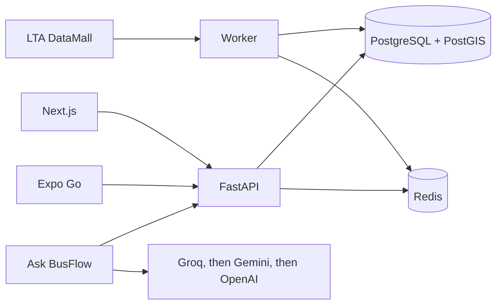

# SG BusFlow

**Real-time Singapore bus arrivals, nearby stops, journeys, and an in-app assistant — on a Next.js site and an Expo app, from one FastAPI service.**

SG BusFlow shows stops around you, the next buses, and a walk-plus-bus trip. **Ask BusFlow** is the part other Singapore bus apps leave out: you ask in plain language, and it looks up the same live stops, arrivals, and journeys, then answers with a short reply and tappable cards. Minutes come from [LTA DataMall](https://datamall.lta.gov.sg/). The website, the phone, and the model never invent a time. There is no account: saved stops stay on the device. This repository is the **portfolio / example** source. It runs with Docker on a development machine. It is not deployed.

[](https://nextjs.org/)
[](https://www.typescriptlang.org/)
[](https://expo.dev/)
[](https://fastapi.tiangolo.com/)
[](https://www.postgresql.org/)
[](https://redis.io/)

**Example repository:** [github.com/Gooniez3/SG-BusFlow](https://github.com/Gooniez3/SG-BusFlow)

## Product overview

A bus app that invents an arrival time is worse than one that says the feed is late. SG BusFlow keeps LTA behind one worker, stores the network in PostgreSQL with PostGIS, and keeps the latest minutes in Redis. Web and Expo only read that API. Ask BusFlow is a tab on both clients. It calls tools on that same API, then explains the result. It does not plan the route itself and it does not offer MRT.

If GPS is denied, the app says location is off and uses a Boon Lay pin so the screens are not blank. Light theme is the default. Dark theme is a switch in the header.

## Core features

| Capability | What it provides |
| --- | --- |
| **Ask BusFlow** | Chat for "buses near me", "how do I get to Changi Airport?", or "when is the next 230?". Tools search stops, read cached arrivals, and run the journey planner. The reply is one or two sentences. Cards open the stop or the trip. |
| **Nearby stops** | Stops within walking distance, with the next buses on the first stop. |
| **Search** | Stop name, road, code, or bus number. |
| **Live arrivals** | Minutes, load, and a map of buses at the stop. Updates over a WebSocket. |
| **Map** | Nearby stops on OpenStreetMap, with a live sheet for the selected stop. |
| **Journey** | Walk, bus, and at most two transfers. Ranked by time or by fewer changes. |
| **Saved** | Stops and services kept on this phone or browser. No login. |
| **Arrival alerts** | Optional local notification when a saved stop or the last journey's first bus is inside 3, 5, or 8 minutes. Off by default. |
| **Stale data** | If LTA fails, the last cached minutes stay up and are marked late. |

## Product walkthrough

Shot on Expo Go, around Lorong 6 Toa Payoh.

### Nearby


The nearest stop opens with the buses serving it. Distance is walking distance from the phone.

### Search


A name search lists nearby matches first, then other stops with the same name.

### Stop


### Live bus


### Journey


The plan is walk, board, and alight. "Next bus" is a cached minute, not a guessed clock time.

### Map


### Ask BusFlow


"Find buses near me" returns the stops the API already has, with walking distance. Open a card for arrivals. A place question uses the same journey planner as the Journey screen. If the cache has no minute, the reply says live times are not available.

### Saved


### Dark theme

| Nearby | Map |
| --- | --- |
|  |  |

| Journey | Saved |
| --- | --- |
|  |  |

## How it works



The worker is the only process that calls DataMall. It writes stops, routes, and route-stops into Postgres, and arrivals plus the service list into Redis. FastAPI reads those stores. A WebSocket publishes arrival updates from Redis to whoever is watching that stop. Ask BusFlow sends the question to the model with tools. Those tools read the same API. The model writes the sentence. The cards are the tool results.

## Arrival integrity

A minute on screen has to be traceable to LTA.

| Guard | Behavior |
| --- | --- |
| **One caller** | Handlers and clients do not call DataMall. `backend/services/lta/` does. |
| **No invented times** | Journey ranking uses cached minutes. Missing cache means no live wait, not a made-up one. |
| **Stale cache** | After an LTA error, the previous payload is returned with `stale: true` and `age_seconds`. |
| **Redis down** | Stop search and journey planning still use Postgres. Live minutes wait until Redis is back. |
| **Assistant tools** | Stops, services, arrivals, live buses, and journeys in a reply come from tool results. An empty result is "BusFlow does not have that", not a guess. |
| **One worker** | The arrival loop is its own process. Extra API containers do not each poll LTA. |
| **Migrations** | `alembic upgrade head` is a separate command. API startup does not change the schema. |

## Technology stack

| Area | Technologies |
| --- | --- |
| **Web** | Next.js 15, React 19, TypeScript, Tailwind CSS 4, Leaflet |
| **Mobile** | Expo, React Native, TypeScript, Expo Go |
| **API** | Python 3.12, FastAPI, Pydantic, SQLAlchemy, Alembic, GeoAlchemy2 |
| **Data** | PostgreSQL 16, PostGIS 3.5, Redis 7 |
| **Live** | WebSockets, Redis pub/sub |
| **Ask BusFlow** | Groq first (`openai/gpt-oss-120b`), then Gemini, then OpenAI. Tools call the same API data. |
| **Run and check** | Docker Compose, pytest, GitHub Actions |

## Project structure

```text
SG BusFlow/
|-- apps/web/                 # Next.js client
|-- apps/mobile/              # Expo client
|-- backend/api/              # FastAPI app, Alembic, tests
|-- backend/services/         # LTA client and Redis cache
|-- backend/workers/          # Static ingest and arrival loop
|-- docs/screenshots/         # Expo Go shots used above
|-- docker-compose.yml        # API, worker, Postgres, Redis
`-- .github/workflows/ci.yml
```

## Local development

### Prerequisites

- Docker Desktop
- Node.js 22
- An [LTA DataMall](https://datamall.lta.gov.sg/) account key

### Setup

```bash
git clone https://github.com/Gooniez3/SG-BusFlow.git
cd SG-BusFlow
```

```bash
cp .env.example .env
# Set LTA_ACCOUNT_KEY
docker compose up --build -d
docker compose run --rm api alembic upgrade head
docker compose run --rm worker python -m workers static
```

`static` loads stops, services, and routes. Without it, name search still works from Postgres, but a bus-number search has no catalogue. Run it again after Redis restarts. Redis has no volume. `postgres_data` survives `docker compose down`. `docker compose down -v` deletes the database.

Web:

```bash
cd apps/web
npm install
npm run dev
```

Open [http://127.0.0.1:3000](http://127.0.0.1:3000).

Expo, on the same Wi-Fi as the computer:

```bash
cd apps/mobile
npm install
npx expo start --lan
```

The phone calls port 8000 on the Metro host. `EXPO_PUBLIC_API_URL` is only the fallback when that host is localhost.

API checks: [http://127.0.0.1:8000/health](http://127.0.0.1:8000/health), [http://127.0.0.1:8000/health/ready](http://127.0.0.1:8000/health/ready), [http://127.0.0.1:8000/docs](http://127.0.0.1:8000/docs).

## Environment configuration

Use [.env.example](.env.example). Never commit `.env`.

| Variable | Purpose |
| --- | --- |
| `DATABASE_URL` | Host Postgres URL. Compose points containers at `postgres:5432`. |
| `REDIS_URL` | Host Redis URL. Compose points containers at `redis:6379`. |
| `LTA_ACCOUNT_KEY` | DataMall key. Empty means the worker stays up and does not ingest. |
| `CORS_ORIGINS` | Local web (`:3000`) and Expo (`:8081`). |
| `GROQ_API_KEY` | Assistant. `GEMINI_API_KEY` and `OPENAI_API_KEY` are fallbacks. |
| `LTA_WATCH_STOPS` | Optional codes for the arrival loop. Stops you open are watched too. |

If `backend/api/.env` also exists, its values override the root file. Compose still forces the database and Redis hosts inside containers.

## Reliability and engineering

- **Health:** `/health` only checks that the process is up, so an LTA outage does not mark the API dead. `/health/ready` reports database and Redis.
- **Cache age:** arrival payloads include `stale` and `age_seconds`.
- **Rate limits:** HTTP, journey, and assistant chat are capped per minute. Tests bypass the limiter.
- **WebSocket caps:** total connections and connections per address are limited so the map cannot open an unbounded set.
- **Tests:** from `backend/api`, `python -m pytest -q`.
- **CI:** `.github/workflows/ci.yml` on pushes to `main` and on pull requests. PostGIS, Redis, `alembic upgrade head`, pytest, web lint and build, Expo typecheck, Docker image build. No LTA calls and no API keys.

## Security and privacy

- The DataMall key and model keys live in `.env`, not in Git and not in the image.
- Clients do not receive those keys.
- Saved stops are local storage on the device.
- There is no user account and no password store.

No credentials belong in this repository.

## License

Copyright © 2026 Saw Lwin Htoo. All rights reserved.

This repository is source-visible for portfolio and evaluation purposes. It is **not open source**, and no permission is granted to redistribute, modify, sublicense, sell, or commercially reuse substantial portions of the software without prior written permission. See [LICENSE](LICENSE) for the complete terms.

## Author

**Saw Lwin Htoo (Finn)**

Full-Stack Developer / Software Engineer focused on building modern web applications and production systems for real operators.

- GitHub: [@Gooniez3](https://github.com/Gooniez3)
- Portfolio: [finn-portfolio-blush.vercel.app](https://finn-portfolio-blush.vercel.app)
- Related project: [CapyTech POS](https://github.com/Gooniez3/capytech-pos)
